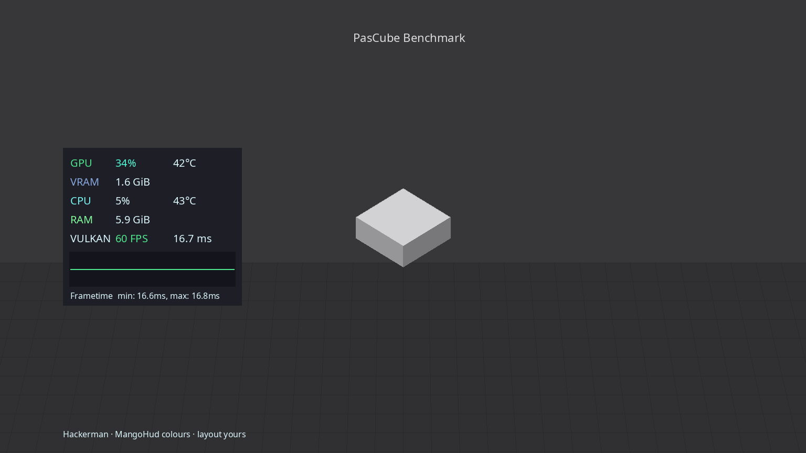
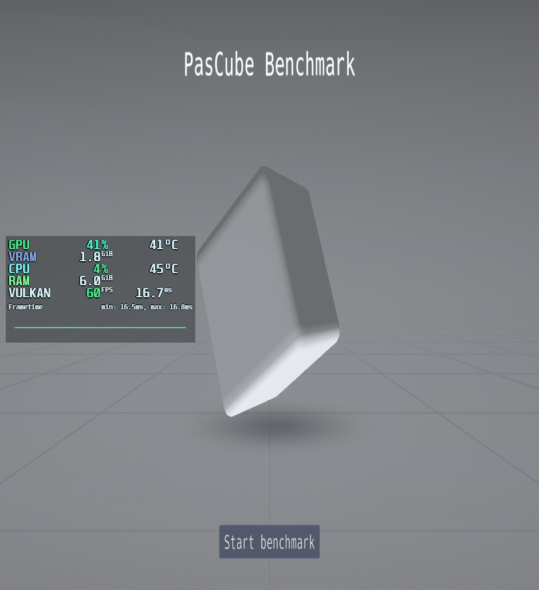

# OmaHud

**Omarchy themes your desktop. OmaHud retints MangoHud — colours only —
so Goverlay (or your hand-tuned conf) keeps owning metrics, layout, and
keybinds.**



The early “drop a full `mangohud.conf.tpl` into Omarchy’s themed templates”
path worked like Catppuccin Mango packs: every theme switch replaced the whole
HUD file and smashed people’s layouts. Fine as a theme-pack experiment; wrong
once Style plugins got good. OmaHud is the other side of that idea.

## Goals

| Goal | What that means here |
|------|----------------------|
| Colours only | Rewrite existing `*_color` keys in `~/.config/MangoHud/MangoHud.conf`. Never invent `gpu_stats`, positions, or hotkeys. |
| Goverlay stays useful | Build the metrics layout in Goverlay; OmaHud only repaints. By default it also retints Goverlay’s own `gameconfig/*/MangoHud.conf` so the colour pickers match (not stock MangoHud green). |
| Style carousel | Mock HUD tiles from every `colors.toml` — faster than hopping themes and restarting vkcube / games. Panel sits inside the ~8% Style crop inset (same SAFE_X as OmaOBS / OmaTTY) so labels don’t get chopped. |
| Theme-set sync | Hook keeps HUD colours with the desktop (same idea as OmaOBS / OmaCursor). |
| Escape hatch | First apply snapshots prior colours; `omahud clear` puts them back. |

Live PasCube / Goverlay cube is still the ground truth for the *real* overlay;
Style mockups are for picking a tint quickly. Real layout-faithful mockups come
later — for now we keep a True Theme Vibe reference of a live shot:

**Reference — live PasCube (middle-left metrics, Hackerman colours):**

| Real HUD (PasCube) | OmaHud mockup (same silhouette) |
| --- | --- |
|  |  |

Style carousel tiles use the same panel chrome, recoloured from each theme’s
`colors.toml`. (`MANGOHUD_CONFIGFILE` + conf with `no_display` stripped for
shots — bare `MANGOHUD_CONFIG=…` alone falls back to stock top-left chrome.)

## Install

```sh
omarchy plugin add https://github.com/AlxWolfenstein97/omahud.git --enable
```

Or from a checkout:

```sh
~/.config/omarchy/plugins/io.github.alxwolfenstein97.omahud/install.sh
omarchy plugin enable io.github.alxwolfenstein97.omahud
```

**Needs (installer pulls when missing):**

| Package | Why |
|---------|-----|
| `python-pillow` | Style → HUD Themes mockups |
| `mangohud` | The overlay being retinted |

If `MangoHud.conf` does not exist yet, set metrics once in **Goverlay** (or
copy a conf), then Style → HUD Themes / `omahud sync`. Install removes any
legacy full-file `theme-set.d/mangohud` hook so templates stop overwriting you.

`omarchy pkg add` needs sudo — interactive install asks in-TTY; shell-service
`--quiet` opens one floating terminal once when packages are missing.

## How it works

1. Style → **HUD Themes** warms PNG mockups, then `omahud-set <theme>` patches
   colour keys in place (live conf **and** Goverlay’s GUI copy by default).
2. `~/.config/omarchy/hooks/theme-set.d/omahud` runs `omahud-sync` after every
   desktop theme switch.
3. Goverlay keeps writing layout/metrics into the same files. If you pick a
   built-in colour preset (**MangoHud Stock**, **Simple White**, **Afterburner**,
   **GOverlay**) and save, those colours land until the next sync / Style pick —
   intentional: OmaHud is for matching Omarchy themes, not fighting hand-tuned
   Goverlay paint. Layout/metrics from any preset stay; only `*_color` keys move.

Catppuccin’s MangoHud pack is a full-file replace (layout + pastel colours) —
same smash as the old themed `.tpl`. OmaHud keeps the split: your metrics, our
tints.

Disable Goverlay GUI sync if you only want `~/.config/MangoHud/MangoHud.conf`:

```sh
touch ~/.local/state/omarchy/omahud/no-goverlay-sync
# or: OMAHUD_SYNC_GOVERLAY=0 omahud sync
```

CLI:

```sh
omahud list
omahud show tokyo-night
omahud set tokyo-night      # pin HUD to that palette
omahud sync                 # follow current Omarchy theme
omahud clear                # restore pre-OmaHud colours
omahud preview              # warm mockups
omahud switcher             # image picker → slug on stdout
```

## Uninstall

```sh
~/.config/omarchy/plugins/io.github.alxwolfenstein97.omahud/uninstall.sh
omarchy plugin remove io.github.alxwolfenstein97.omahud
# optional: omahud clear   # before remove, if you want old colours back
```

## Check

```sh
bash ~/.config/omarchy/plugins/io.github.alxwolfenstein97.omahud/check.sh
```

## Credits

- **Layout reference:** [`reference-mangohud-pascube.png`](reference-mangohud-pascube.png)
  — live `mangohud pascube` with the user’s middle-left metrics layout
  (**Hackerman** colours). Mockups trace that 3-col panel + frametime graph.
- Sibling Style plugins: [OmaOBS](https://github.com/AlxWolfenstein97/omaobs),
  [OmaCursor](https://github.com/AlxWolfenstein97/omacursor),
  [OmaBoot](https://github.com/AlxWolfenstein97/omaboot),
  [OmaVT](https://github.com/AlxWolfenstein97/omavt),
  [OmaTTY](https://github.com/AlxWolfenstein97/omatty),
  [Chroma](https://github.com/AlxWolfenstein97/chroma).
- [MangoHud](https://github.com/flightlessmango/MangoHud) +
  [Goverlay](https://github.com/benjamimgois/goverlay) — metrics UI; we only
  touch the paint.
- [Omarchy](https://omarchy.org/) — Style menu + theme-set hooks.

## License

MIT — see [LICENSE](LICENSE).
